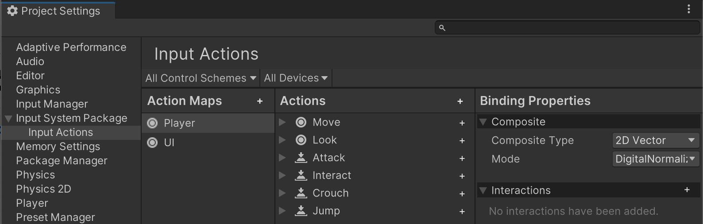

# Create, edit and delete actions

The simplest way to create, edit, or delete actions is to use the [Input Actions editor](actions-editor.md) in the Project Settings window. This is the primary recommended workflow and suitable for most scenarios.

However, there are many other ways to work with actions which might suit less common scenarios. For example, by [loading actions from JSON data](configure-input-from-json.md), or [creating actions entirely in code](configure-input-directly-from-code.md).

## Create Actions using the Action editor

For information on how to create and edit Input Actions in the editor, see the [Input Actions editor](actions-editor.md). This is the recommended workflow if you want to organize all your input actions and bindings in one place, which applies across the whole of your project. This often the case for most types of game or app.

*The Input Actions Editor in the Project Settings window*

### Add, rename, duplicate or delete actions

* To add a new Action, select the Add (+) icon in the header of the Action column.
* To rename an existing Action, either long-click the name, or right-click the Action and select __Rename__ from the context menu.
* To delete an existing Action, either right-click it and select __Delete__ from the context menu.
* To duplicate an existing Action, either right-click it and select __Duplicate__ from the context menu.

If you’d like to delete all the actions so that you can start from an empty configuration, you don’t need to delete the individual actions one-by-one. You can delete each Action Map, which deletes all the Actions contained in the maps in one go.

You can also delete all action maps, or reset all the actions back to the default values from the **more** (⋮) menu at the top right of the Input Actions section of the settings window, below the Project Settings window search field.

> [!NOTE]
> This **more** (⋮) menu is only available when the Actions Editor is viewed within the Project Settings window. It isn't available when the Actions Editor is open in a separate window.

## Other ways to create Actions

The Input System package API supports less common scenarios. To customize your project beyond the standard workflow, you can use these alternative techniques to create actions:

- [Stand-alone actions](declare-standalone-actions.md)
- [Loading actions from JSON](configure-input-from-json.md)
- [Creating actions in code](configure-input-from-code.md)
