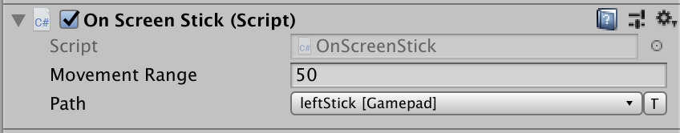

# Create an on-screen stick control

To create an on-screen stick:

1. Create a UI `Image` object.
2. Add the [`OnScreenStick`](../api/UnityEngine.InputSystem.OnScreen.OnScreenStick.html) component to it.
3. Set the [`controlPath`](../api/UnityEngine.InputSystem.OnScreen.OnScreenControl.html#UnityEngine_InputSystem_OnScreen_OnScreenControl_controlPath) to refer to a [`Vector2Control`](../api/UnityEngine.InputSystem.Controls.Vector2Control.html) (for example, `<Gamepad>/leftStick`). The type of device referenced by the control path determines the type of virtual device created by the component.

The [`OnScreenStick`](../api/UnityEngine.InputSystem.OnScreen.OnScreenStick.html) component requires the target control to be a `Vector2` control. [`OnScreenStick`](../api/UnityEngine.InputSystem.OnScreen.OnScreenStick.html) starts the movement of the stick control when it receives a pointer-down (`IPointerDownHandler.OnPointerDown`) event, and stops it when it receives a pointer-up (`IPointerUpHandler.OnPointerUp`) event.

In-between, the stick moves according to the pointer being dragged (`IDragHandler.OnDrag`) within a box centered on the pointer-down screen point, and with an edge length  defined in the component's __Movement Range__ property. A movement range of 50, for example, means that the stick's on-screen area is 25 pixels up, down, left, and right of the pointer-down point on screen.

If you want to be notified when the user starts and/or stops touching the on-screen stick, implement `IPointerDownHandler` and/or `IPointerUpHandler` on a component and add it to the stick `GameObject`.

## Isolate stick controls

The [`OnScreenStick`](../api/UnityEngine.InputSystem.OnScreen.OnScreenStick.html) simulates input events from the device specified in the [`OnScreenControl.control`](../api/UnityEngine.InputSystem.OnScreen.OnScreenControl.html#UnityEngine_InputSystem_OnScreen_OnScreenControl_control) property. To the Input System itself, these are normal events and can cause the paired device to change in games and applications where dynamic device switching is used, for example when the [`PlayerInput`](../api/UnityEngine.InputSystem.PlayerInput.html) component is used with the [`PlayerInput.neverAutoSwitchControlSchemes`](../api/UnityEngine.InputSystem.PlayerInput.html#UnityEngine_InputSystem_PlayerInput_neverAutoSwitchControlSchemes) propety set to false. As the stick is dragged around, the paired device will alternate between the device that owns the pointer (mouse, touch, pen etc) and the device from the control path, which can result in jittery movement of the on-screen stick.

To fix this, enable **Use Isolated Input Actions**. This mode uses a local set of input action instances to drive interaction with the stick, and not the actions defined in the UI. The downside of this mode is that pointer actions will be duplicated in both the on-screen stick component and any input action assets being used to drive the UI. Note that if a set of bindings is not specified for the Pointer Down action and Pointer Move actions, the following defaults will be used:

* Pointer Down action
    - `<Mouse>/leftButton`
    - `<Pen>/tip`
    - `<Touchscreen>/touch*/press`
    - `<XRController>/trigger`

* Pointer Move action
    - `<Mouse>/position`
    - `<Pen>/position`
    - `<Touchscreen>/touch*/position`