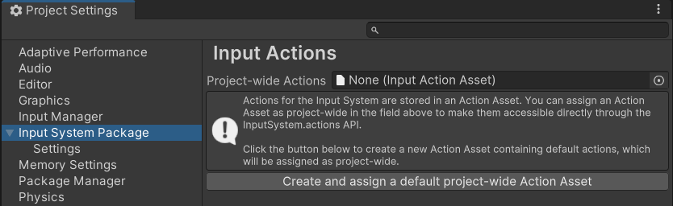

# Create and assign a default project-wide actions asset

Follow these steps to create an actions asset that contains the built-in [default actions](./TheDefaultActions.md), and assign them as project-wide.

Open the Input System Package panel in Project Settings, by going to **Edit** > **Project Settings** > **Input System Package**.

If you don't yet have an Action Asset assigned as project-wide in your project, the Input System Package settings window displays an empty field for you to assign your action asset, and a button allowing you to create and assign one.

 
*The Input System Package Project Settings with no project-wide actions assigned*

> **Note:** If you already have an Action Asset assigned, this button is not displayed, and instead the Actions Editor is displayed, allowing you to edit the project-wide actions.

Click  **"Create a new project-wide Action Asset"**.

The asset is created in your project, and automatically assigned as the **project-wide actions**.

The Action Asset appears in your Project view, and is named "InputSystem_Actions". This is where your new configuration of actions is saved, including any changes you make to it.

 
*The new Actions Asset in your Project window*

When you create an action asset this way, the new asset contains a set of default actions that are useful in many common scenarios. You can [configure them](./ConfigureActions.md) or [add new actions](./CreateActions.md) to suit your project.

*The Input System Package Project Settings after creating and assigning the default actions*

Once you have created and assigned project-wide actions, the Input System Package page in Project Settings displays the **Actions Editor** interface. Read more about how to use the [Actions Editor](ActionsEditor.md) to configure your actions.