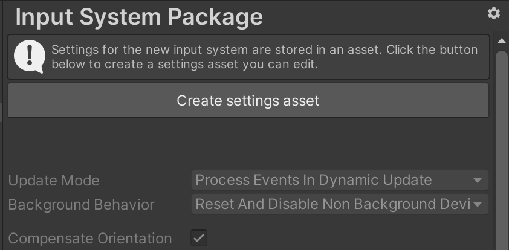

# Create a settings asset

When you first view the input settings, they are not editable, and instead a button to __Create settings asset__ is displayed at the top of the input settings window.

If you want to customise the input settings, you must first click this button, which creates a settings asset in your Project. Once your project contains a settings asset, the __Create settings asset__ is no longer displayed, and the settings fields become editable. Unity saves changes to your settings in the settings asset when you save the project.

If your project contains multiple settings assets, you can use the gear menu in the top-right corner of the window to choose which asset to use. You can also use this menu to create addit
