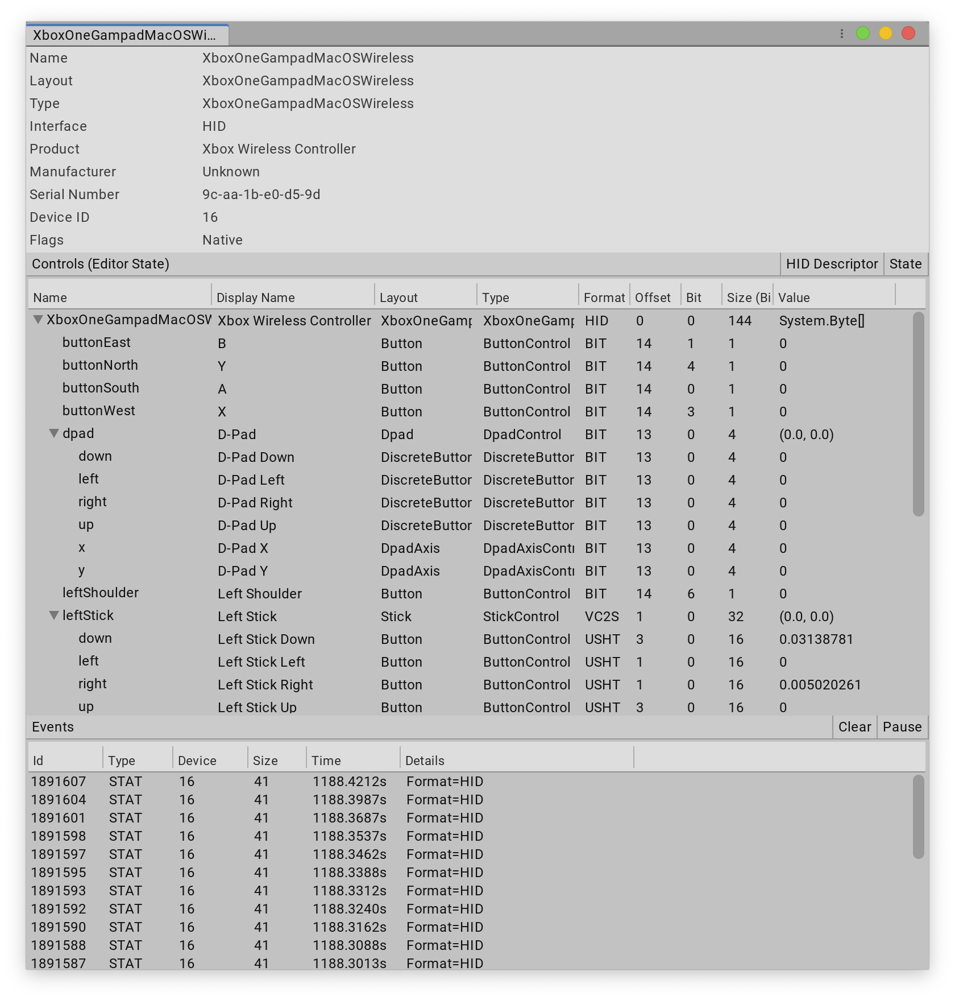

# Debug a device

In the Input Debugger window, navigate to the __Devices__ list and double-click any [Input Device](devices.md). This opens a window that displays information about the Device, including real-time state information for its Controls.

The top of the Device window displays general information about the specific Device, such as name, manufacturer, and serial number. This section also display the current __sample frequency__ and __processing delay__ of the deivce.

__Sample frequency__ indicates the frequency in Hertz (Hz) at which the Input System is currently processing samples or events. For devices receiving events this reflects the current flow of events received by the system. For devices receiving periodic readings this reflects the achievable sample rate of the system. The latter may be compared to the globally configured target sampling frequency, while achievable event frequency is uncorrelated to the sample polling frequency setting.

__Processing delay__ indicates the average, minimum and maximum latency contribution from creating an input event or reading until the Input System has processed the same input event. Note that this excludes any additional input delay caused by OS, drivers or device communication. Also note that this excludes any additional output latency that may be caused by additional processing, rendering, GPU swap-chains or display refresh rate.

The __Controls__ section lists the Device's Controls and their individual states. This is useful when debugging input issues, because you can verify whether the data that the Input System receives from the Input Device is what you expect it to be. There are two buttons at the top of this panel:

* __HID Descriptor__: Only displayed for devices that use the HID protocol to connect. This opens a window that displays the detailed [HID](hid-specification-introduction.md) specifications for the Device and each of it's logical controls.

* __State__: Display the current state of the Device in a new window. This is identical to the information displayed in this view, but doesn't update in real time, so you can take a snapshot of input state data and take the time to inspect it as needed.

The __Events__ section lists all [input events](input-events.md) generated by the Device. You can double-click any event in the list to inspect the full Device state at the time the event occurred. To get a side-by-side difference between the state of the Device at different points in time, select multiple events, right-click them, and click __Compare__ from the context menu.
