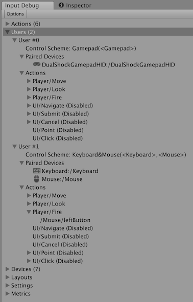

# Debug users and PlayerInput 

When there are [`InputUser`](UserManagement.md) instances (if you use `PlayerInput`, each `PlayerInput` instance implicitly creates one), the Input Debugger's __Users__ list displays each instance along with its paired Devices and active Actions. The listed Devices and Actions work the same way as those displayed in the [__Devices__](#debugging-devices) and [__Actions__](#debugging-actions) lists in the debugging window.

