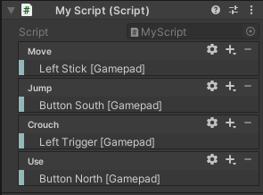

# Declare stand-alone actions

You can declare individual [`InputAction`](xref:UnityEngine.InputSystem.InputAction) and [`InputActionMap`](xref:UnityEngine.InputSystem.InputActionMap) objects as fields directly inside `MonoBehaviour` components.

```CSharp
using UnityEngine;
using UnityEngine.InputSystem;

public class ExampleScript : MonoBehaviour
{
    public InputAction move;
    public InputAction jump;
}
```

The result is similar to using an action defined in the Input Actions Editor, except that you define the actions in the GameObject's properties and save them as scene or prefab data, instead of in a dedicated asset.

When you define serialized `InputAction` fields in a `MonoBehaviour` component to embed actions, the GameObject's Inspector window displays a script component similar to the "Actions" panel of the [Input Actions Editor](actions-editor.md):



This interface allows you to set up the bindings for those actions. For example:

* To add or remove actions or bindings, click the Add (+) or Remove (-) icon in the header.
* To edit bindings, double-click them.
* To edit actions, double-click them in an action map, or click the gear icon on individual action properties.
* You can also right-click entries to bring up a context menu, and you can drag them. Hold the Alt key and drag an entry to duplicate it.
* To duplicate an entry, hold the Alt key while dragging it.

Unlike the project-wide actions in the **Project Settings** window, you must manually enable and disable Actions and action maps that are embedded in MonoBehaviour components.

When you use this workflow, the serialized action configurations are stored with the parent GameObject as part of the scene, instead of being serialized with an action asset. This can be useful if you want to bundle the control bindings and behavior together in a single MonoBehaviour or prefab, so it can be distributed together. However, this can also make it harder to organize your full set of control bindings if they are distributed across multiple prefabs or scenes.
