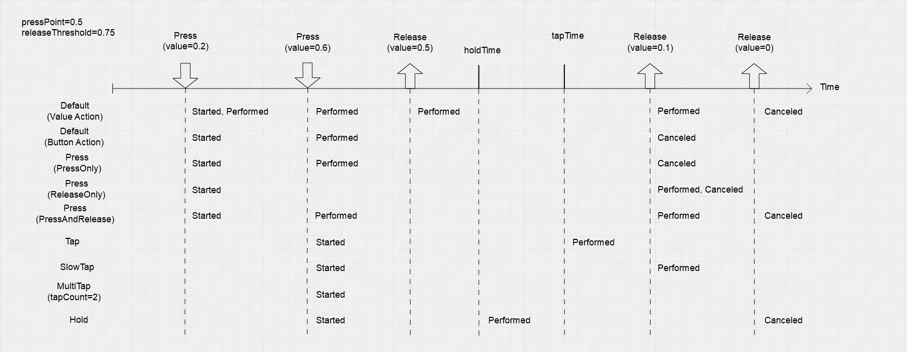

# Default interactions

Different Action types have different default Interactions. For example, the following diagram shows the behavior of the built-in Interactions for a simple button press.

The following table provides an at-a-glance overview of how Interaction phases change for each action type's default Interaction.

|__Callback__|[`InputActionType.Value`](about-action-control-types.md#action-type)|[`InputActionType.Button`](about-action-control-types.md#action-type)|[`InputActionType.PassThrough`](about-action-control-types.md#action-type)|
|-----------|-------------|------------|-----------------|
|[`started`](xref:UnityEngine.InputSystem.InputAction)|Control(s) changed value away from the default value.|Button started being pressed but has not necessarily crossed the press threshold yet.|not used|
|[`performed`](xref:UnityEngine.InputSystem.InputAction)|Control(s) changed value.|Button was pressed to at least the button [press threshold](xref:UnityEngine.InputSystem.InputSettings).|Control changed value.|
|[`canceled`](xref:UnityEngine.InputSystem.InputAction)|Control(s) are no longer actuated.|Button was released. If the button was pressed above the press threshold, the button has now fallen to or below the [release threshold](xref:UnityEngine.InputSystem.InputSettings). If the button was never fully pressed, the button is now back to completely unpressed.|Action is disabled.|

## Value Action default Interaction

[`Value`](about-action-control-types.md#action-type)-type Actions have a default Interaction with the following behavior:

1. As soon as a bound Control becomes [actuated](control-actuation.md), the Action's Interaction phase goes from `Waiting` to `Started`, and then immediately to `Performed` and back to `Started`. One callback occurs on [`InputAction.started`](xref:UnityEngine.InputSystem.InputAction), followed by one callback on [`InputAction.performed`](xref:UnityEngine.InputSystem.InputAction).
2. For as long as the bound Control remains actuated, the Action's Interaction phase stays in `Started` and triggers `Performed` whenever the value of the Control changes (that is, one call occurs to [`InputAction.performed`](xref:UnityEngine.InputSystem.InputAction)).
3. When the bound Control stops being actuated, the Action's Interaction phase goes to `Canceled` and then back to `Waiting`. One call occurs to [`InputAction.canceled`](xref:UnityEngine.InputSystem.InputAction).

## Button Action default Interaction

[`Button`](about-action-control-types.md#action-type)-type Actions have a default Interaction with the following behavior:

1. As soon as a bound Control becomes [actuated](control-actuation.md), the Action's Interaction phase goes from `Waiting` to `Started`. One callback occurs on [`InputAction.started`](xref:UnityEngine.InputSystem.InputAction).
2. If a Control then reaches or exceeds the button press threshold, the Action's Interaction phase goes from `Started` to `Performed`. One callback occurs on [`InputAction.performed`](xref:UnityEngine.InputSystem.InputAction). The default value of the button press threshold is defined in the [input settings](xref:UnityEngine.InputSystem.InputSettings). However, an individual control can [override](xref:UnityEngine.InputSystem.Controls.ButtonControl) this value.
3. Once the Action has `Performed`, if all Controls then go back to a level of actuation at or below the [release threshold](xref:UnityEngine.InputSystem.InputSettings), the Action's Interaction phase goes from `Performed` to `Canceled`. One call occurs to [`InputAction.canceled`](xref:UnityEngine.InputSystem.InputAction).
4. If the Action's Interaction phase never went to `Performed`, it will go to `Canceled` as soon as all Controls are released. One call occurs to [`InputAction.canceled`](xref:UnityEngine.InputSystem.InputAction).

## PassThrough Action default Interaction

[`PassThrough`](about-action-control-types.md#action-type)-type Actions have a default Interaction with a simpler behavior. The Input System doesn't try to track bound Controls as a single source of input. Instead, it triggers a `Performed` callback for each value change.
