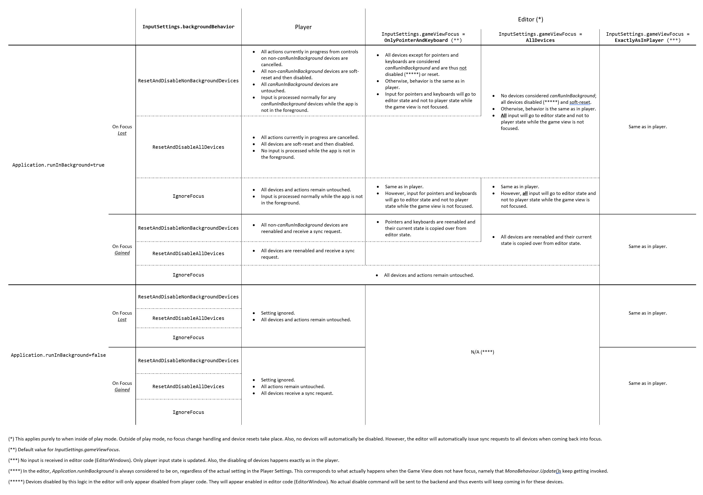

# Device background and focus changes

In general, input is tied to [application focus](https://docs.unity3d.com/ScriptReference/Application-isFocused.html). This means that Devices do not receive input while the application is not in the foreground and thus no [Actions](actions.md) will receive input either. When the application comes back into focus, all devices will receive a [sync](sync-device.md) request to have them send their current state (which may have changed while the application was in the background) to the application. Devices that do not support sync requests will see a [soft reset](reset-device.md) that resets all Controls not marked as [`dontReset`](control-items.md) to their default state.

On platforms such as iOS and Android, that do not support running Unity applications in the background, this is the only supported behavior.

If the application is configured to run while in the background (that is, not having focus), input behavior can be selected from several options. This is supported in two scenarios:

* In Unity's [Player Settings](https://docs.unity3d.com/Manual/class-PlayerSettings.html) you can explicity enable `Run In Background` for specific players that support it (such as Windows or Mac standalone players). Note that in these players this setting is always enabled automatically in *development* players.
* In the editor, application focus is tied to focus on the Game View. If no Game View is focused, the application is considered to be running in the background. However, while in play mode, the editor will *always* keep running the player loop regardless of focus on the Game View window. This means that in the editor, `Run In Background` is considered to always be enabled.

If the application is configured this way to keep running while in the background, the player loop and thus the Input System, too, will keep running even when the application does not have focus. What happens with respect to input then depends on two factors:

1. On the ability of individual devices to receive input while the application is not running in the foreground. This is only supported by a small subset of devices and platforms. VR devices ([`TrackedDevice`](xref:UnityEngine.InputSystem.TrackedDevice)) such as HMDs and VR controllers generally support this.  To find out whether a specific device supports this, you can query the [`InputDevice.canRunInBackground`](xref:UnityEngine.InputSystem.InputDevice) property. This property can also be forced to true or false with a Device's [layout](control-items.md).
2. On two settings you can find in the project-wide [Input Settings](input-settings.md). Specifically, [`InputSettings.backgroundBehavior`](xref:UnityEngine.InputSystem.InputSettings) and [`InputSettings.editorInputBehaviorInPlayMode`](xref:UnityEngine.InputSystem.InputSettings). The table below shows a detailed breakdown of how input behaviors vary based on these two settings and in relation to the `Run In Background` player setting in Unity.

> [!NOTE]
> [`InputDevice.canRunInBackground`](xref:UnityEngine.InputSystem.InputDevice) is overridden by the editor in certain situations (see table below). In general, the value of the property does not have to be the same between the editor and the player and depends on the specific platform and device.

The following table shows the full matrix of behaviors according to the [Input Settings](input-settings.md) and whether the game is running in the editor or in the player.

