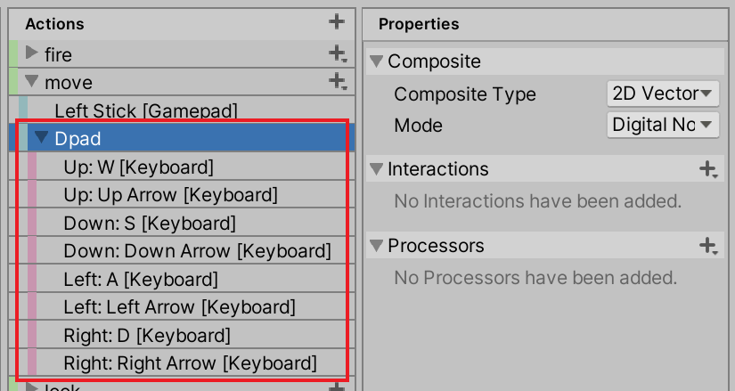

# Edit composite bindings

You can add, edit, and delete [composite bindings](composite-bindings.md) in the [Actions Editor window](actions-editor.md).

When you [add a composite binding](./add-duplicate-delete-binding.md), the Input System creates a set of individual sub-bindings, or **parts** to match the type of composite. For example, a 2D Vector composite has four parts, up, down, left and right. These are visible in the hierarchy of the selected action in the Actions panel. Each part is a **simple binding** as described in [binding types](./binding-types.md).

A new composite binding's parts are initially unassigned, and display "No Binding" in the actions panel.

## Assign bindings to each part of the composite

To assign bindings to each part of the composite:

1. In the Actions panel, select the Action whose composite binding you want to edit.
2. Expand the Action's hierarchy as necessary to display the composite binding and its parts.
3. Select the part you want to configure
4. In the Binding Properties panel, [select a control for this part](./select-control-binding.md) using the Path field.

## Change a composite's type

A composite binding's type controls the selection of parts it has, and what value it outputs. To change a composite's type:

1. In the Actions panel, select the Action whose type you want to change.
2. Expand the Action's hierarchy as necessary to display the composite binding.
3. Select the composite binding.
4. In the Binding Properties panel, select a new **Composite Type**.

Changing a composite binding's type will change which parts it has, and any configurations on parts that are removed are lost.

## Add or remove extra parts of the composite

You can assign multiple bindings to the same part, and duplicate, cut, copy and paste individual part bindings. To do this:

1. In the Actions panel, select the Action whose composite binding you want to edit.
2. Expand the Action's hierarchy as necessary to display the composite binding and its parts.
3. Select the part you want to duplicate or remove
4. Right-click the part, and select Duplicate, Delete, Copy, Cut, or Paste

By duplicating bindings and then editing the new duplicates, you can bind multiple contrls to the same composite part. For example, to create a single 2D composite which receives input from the WSAD keys and the arrow keys on a keyboard.

 
*A composite 2D vector binding with duplicated parts, allowing multiple keyboard keys to activate the same part of the composite.*
