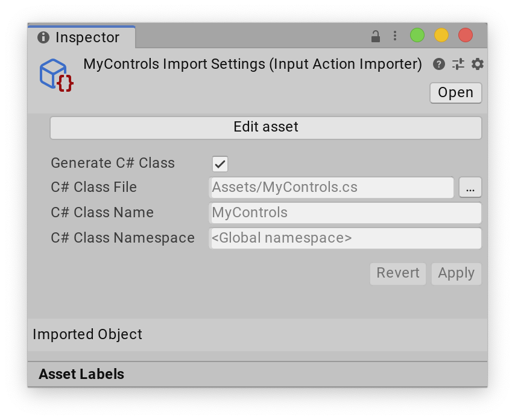

# Generate C# API from actions

Input action assets allow you to **generate a C# class** from your action definitions, which allow you to refer to your actions in a type-safe manner from code.

This removes the need to manually look up Actions and action maps using their names, and also provides an easy way to set up callbacks.

> [!NOTE]
> This is an alternative workflow to [project-wide actions](./about-project-wide-actions.md), and provides a different way to access the actions defined in your action asset.

To enable type-safe C# API generation:

1. Select the action asset in the Project window.
2. In the Inpsector window, enable the __Generate C# Class__ option.
3. Select __Apply__.

You can optionally choose a path name, class name, and namespace for the generated script, or keep the default values.

Once applied, the Input System creates a C# script containing API that matches the actions defined in the asset which you can access directly in code. The following example demonstrates this, assuming there is an action map named "gameplay" containing two actions, "use" and "move" defined in the action asset:

[!code-cs[generate-cs-api](Packages/com.unity.inputsystem/DocCodeSamples.Tests/GenerateCsApiFromActions.cs#generate-cs-api)]

> [!NOTE]
> To regenerate the .cs file, right-click the .inputactions asset in the Project Browser and select **Reimpor**.
