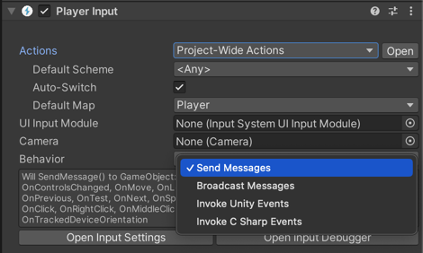

# Get started with the Player Input component

To get started using the Player Input component, use the following steps:

1. [Add](https://docs.unity3d.com/Manual/UsingComponents.html) a **Player Input** component to a GameObject. This would usually be the GameObject that represents the player in your game.
1. Assign your [Action Asset](ActionAssets.md) to the **Actions** field. This is usually the default project-wide action asset named "InputSystem_Actions"
1. Set up Action responses, by selecting a **Behaviour** type from the Behaviour menu. The Behaviour type you select affects how you should implement the methods that handle your Action responses. See the  [notification behaviors](#notification-behaviors) section further down for details.    
