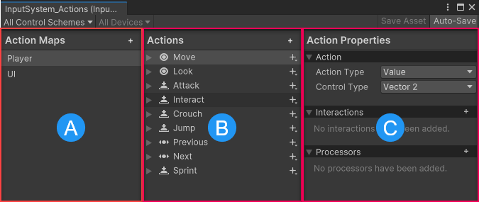

# Input Actions Editor window reference

The **Input Actions Editor** is an Editor window that displays action maps, actions, bindings, and their properties.

 *The Input Actions editor, displaying the default actions*

The Input Actions Editor is divided into three panels:

|Name|Description|
|-|-|
|**(A) Action Maps**|Displays the list of currently defined action maps. Each action map is a collection of actions that you can enable or disable together as a group.|
|**(B) Actions**|Displays all the actions defined in the currently selected action map, and the bindings associated with each action.|
|**(C) Properties**|Displays the properties of the currently selected action or binding from the **Actions** panel. The title of this panel changes depending on whether you have an action or a binding selected in the Actions panel.|

## Action Maps panel reference
|Button|Description|
|-|-|
|**Action Maps**: **Add (+)** button| Select the **Add (+)** button in the Action Maps panel header to create a new Action Map.|

## Actions panel reference
|Button|Description|
|-|-|
|**Actions**: **Add (+)**| Select the **Add (+)** button in the Actions panel header to create a new action.|
|Per-action **Add (+)** button| Select the **Add (+)** button next to an action to create a new binding.|

## Properties panel reference

The properties that appear in the Action Properties and Binding Properties panels differ depending on the action or binding you have selected. For detailed reference documentation, refer to:

* [Action Properties panel reference](action-properties-panel-reference.md)
* [Bindings properties panel reference](binding-properties-panel-reference.md)
