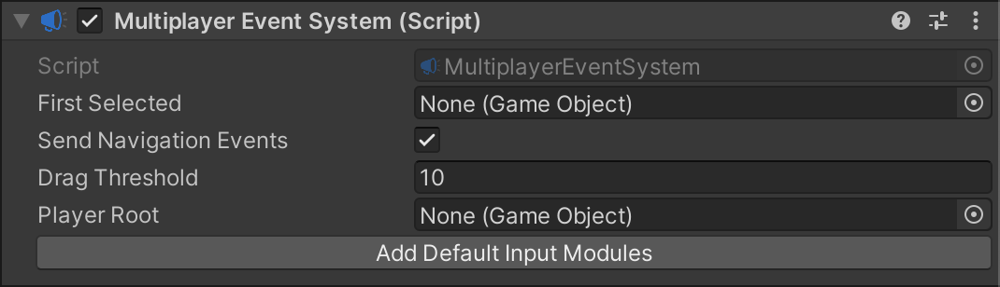

# Introduction to multiplayer UI input

The Input System can handle multiple separate UI instances on the screen controlled separately by different [bindings](bindings.md). This is useful if you want to have multiple local players share a single screen with different controllers, so that every player can control their own UI instance.

To implement multiplayer UI, the Input System uses the Multiplayer Event System.

You can have multiple Multiplayer Event Systems active in the Scene at the same time. This means you can have multiple players, each with their own [UI Input Module](using-ui-input-module.md) and Multiplayer Event System components, and each player can have their own set of actions driving their own UI instance.

The properties of the Multiplayer Event System component are mostly identical to those in the [Event System](https://docs.unity3d.com/Manual/script-EventSystem.html) component. However, the Multiplayer Event System component also has a [Player Root](xref:UnityEngine.InputSystem.UI.MultiplayerEventSystem) property, which defines a parent GameObject for UI [selectables](https://docs.unity3d.com/Manual/script-Selectable.html). When each player has a Multiplayer Event System with a **Player** Root assigned, UI navigation input for each player is limited to UI selectables that are child GameObjects of the Player Root.
