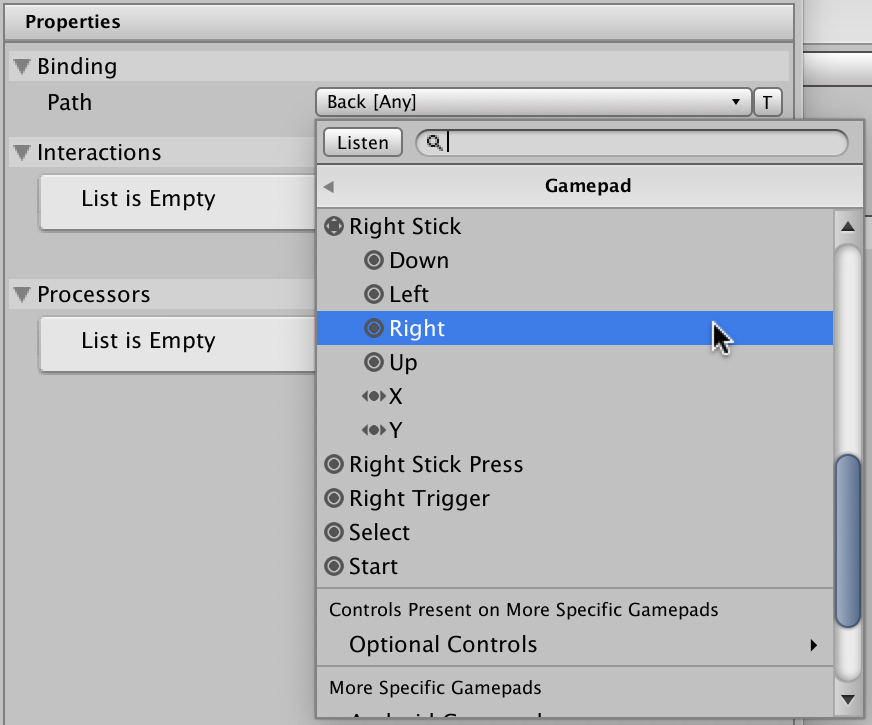

# Select a control for a binding

The [control path](control-paths.md) identifies the control (or controls) that a binding is bound to, such as a button or stick on a gamepad, or a specific keyboard key.

When selecting a control path, there are various levels of specificity you can use, such as referring to a common control across all types of gamepad (such as the left stick on a gamepad), a specific control on a specific model of gamepad (such as the `A` button on an Xbox controller), or a specific control usage across all types of device (such as the control associated with `Back` on any type of device). Refer to [control path specificity](control-paths.md#specificity) for more information.

There are three ways to specify the control path for a binding in the [Actions Editor window](./actions-editor.md). These are:

- Select the control path from a list,
- Select the control path using the listen feature, or
- Enter the path directly by typing text

For all these options, you must first:

1. Open the [Actions Editor window](./actions-editor.md)
2. Select the **action** you want to edit from the [actions panel](./input-actions-editor-window-reference.md#actions-panel-reference)
3. Expand the action to reveal its bindings, or [add a new binding](./add-duplicate-delete-binding.md)
4. Select the **binding** you want to edit

With a binding selected, you can then select the control path using any of these options.

### Select the control path from a list

To select the control path for a binding from a list of available controls:

   1. Select the **Path** dropdown menu.  This displays a hierarchically arranged tree of input devices and controls that the Input System recognizes, which you can browse to find the control you want to bind.

   2. Select the control you want from the list.

Unity filters this list by the Action's [`Control Type`](control-types-reference.md) property. For example, if the Control type is `Vector2`, you can only select a Control that generates two-dimensional values, like a stick.

In this list, use the **Usages** section to [select a control by usage](./control-usages.md) (such as `Back`), rather than by physical endpoint (such as `Button South`).

### Select the control path using the listen feature

Instead of browsing the tree to find the Control you want, if you have the device connected that you want to bind, it can be easier to let the Input System listen for input from that device. To do this:

1. Select the __Listen__ button.
2. Press the button or actuate the control on the device you want to bind to.
3. While the control picker is in listen mode, all buttons or controls you actuate appear in a list.
4. Select the binding from the list to finalise the binding.

### Enter the path directly by typing text

You can choose to manually type the binding path as text instead of using the Control picker. To do this:

1. Select the __T__ button next to the Control path popup. This changes the **path** field from a popup menu to a text field, where you can enter any binding string.
2. Type the control path's binding string into the text field.

Refer to [control paths format](./control-paths.md#format) for more details about valid syntax for this field.
