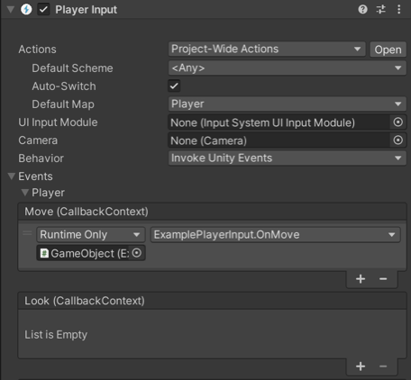

# Select a notification behavior

You can use the [`Behavior`](xref:UnityEngine.InputSystem.PlayerInput) property in the Inspector to determine how a `PlayerInput` component notifies game code when something related to the player has occurred.

The following options are available:

| Behavior value (UI) | Description | Matching enum value |
| -- | -- | -- |
| **Send Messages** | Uses [`GameObject.SendMessage`](https://docs.unity3d.com/ScriptReference/GameObject.SendMessage.html) on the `GameObject` that the `PlayerInput` component belongs to. | [`SendMessages`](xref:UnityEngine.InputSystem.PlayerNotifications.SendMessages) |
| **Broadcast Messages** | Uses [`GameObject.BroadcastMessage`](https://docs.unity3d.com/ScriptReference/GameObject.BroadcastMessage.html) on the `GameObject` that the `PlayerInput` component belongs to. This broadcasts the message down the `GameObject` hierarchy. | [`BroadcastMessages`](xref:UnityEngine.InputSystem.PlayerNotifications.BroadcastMessages) |
| **Invoke Unity Events** | Uses a separate [`UnityEvent`](https://docs.unity3d.com/ScriptReference/Events.UnityEvent.html) for each individual type of message. When this is selected, the events available on the `PlayerInput` are accessible from the __Events__ foldout. The argument received by events triggered for Actions is the same as the one received by [`started`, `performed`, and `canceled` callbacks](xref:input-system-set-callbacks-actions#action-callbacks).   | [`InvokeUnityEvents`](xref:UnityEngine.InputSystem.PlayerNotifications.InvokeUnityEvents) |
| **Invoke CSharp Events** | Similar to **Invoke Unity Events**, except that the events are plain C# events available on the `PlayerInput` API. You cannot configure these from the Inspector. Instead, you have to register callbacks for the events in your scripts.  The following events are available:  <ul><li>[`onActionTriggered`](xref:UnityEngine.InputSystem.PlayerInput.onActionTriggered) (collective event for all actions on the player)</li><li>[`onDeviceLost`](xref:UnityEngine.InputSystem.PlayerInput.onDeviceLost)</li><li>[`onDeviceRegained`](xref:UnityEngine.InputSystem.PlayerInput.onDeviceRegained)</li></ul> | [`InvokeCSharpEvents`](xref:UnityEngine.InputSystem.PlayerNotifications.InvokeCSharpEvents) |

In addition to per-action notifications, `PlayerInput` sends the following general notifications:

| Notification | Description |
| -- | -- |
| [`DeviceLostMessage`](xref:UnityEngine.InputSystem.PlayerInput.DeviceLostMessage) | The player has lost one of the Devices assigned to it. This can happen, for example, if a wireless device runs out of battery. |
| [`DeviceRegainedMessage`](xref:UnityEngine.InputSystem.PlayerInput.DeviceRegainedMessage) | Notification that triggers when the player recovers from Device loss and is good to go again. |
