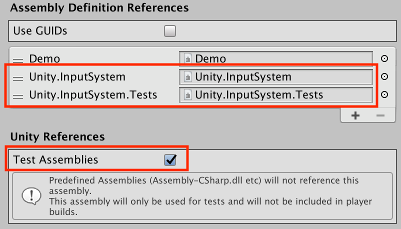

# Set up test assemblies

To set up a test assembly that uses the Input System's automation framework, follow these steps:

1. In the `Packages/manifest.json` file of your project, `com.unity.inputsystem` must be listed in `testables`. This is necessary for test code that comes with the package to be included with test builds of your project.<br><br>You can, for example, add this after the `dependencies` property like so:

    ```
    },
    "testables" : [
        "com.unity.inputsystem"
    ]
    ```

2. Create a new assembly definition (menu: __Create > Assembly Definition__) or go to an assembly definition for a test assembly that you have already created.
3. Add references to `nunit.framework.dll`, `UnityEngine.TestRunner`, and `UnityEditor.TestRunner` (as described in [How to create a new test assembly](https://docs.unity3d.com/Packages/com.unity.test-framework@1.0/manual/workflow-create-test-assembly.html)), as well as `Unity.InputSystem` and `Unity.InputSystem.TestFramework` for the Input System.


