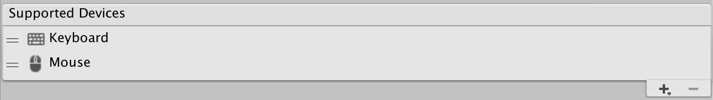

# Supported devices

A Project usually supports a known set of input methods. For example, a mobile app might support only touch, and a console application might support only gamepads. A cross-platform application might support gamepads, mouse, and keyboard, but might not require XR Device support.

To narrow the options that the Editor UI presents to you, and to avoid creating input Devices and consuming input that your application won't use, you can restrict the set of supported Devices on a per-project basis.

If __Supported Devices__ is empty, no restrictions apply, which means that the Input System adds any Device that Unity recognizes and processes input for it. However, if __Support Devices__ contains one or more entries, the Input System only adds Devices that are of one of the listed types.

>__Note__: When the __Support Devices__ list changes, the system removes or re-adds Devices as needed. The system always keeps information about what Devices are available for potential, which means that no Device is permanently lost as long as it stays connected.

To add Devices to the list, click the Add (+) icon and choose a Device from the menu that appears.

## Override in Editor

In the Editor, you might want to use input Devices that the application doesn't support. For example, you might want to use a tablet in the Editor even if your application only supports gamepads.

To force the Editor to add all locally available Devices, even if they're not in the list of __Supported Devices__, open the [Input Debugger](debugging.md) (menu: __Window > Analysis > Input Debugger__), and select __Options > Add Devices Not Listed in 'Supported Devices'__.

>__Note__: This setting is stored as a user setting, not a project setting. This means other users who open the project in their own Editor do not share the setting.