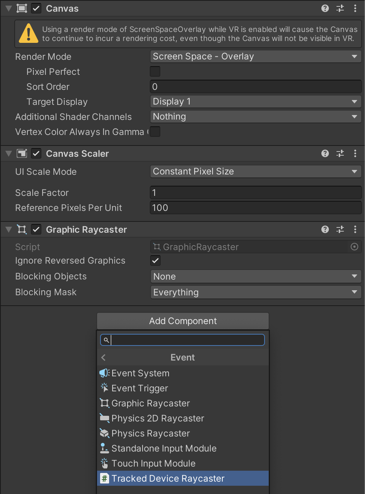
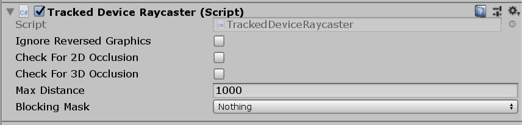

# Tracked input UI support

Input from [tracked devices](xref:UnityEngine.InputSystem.TrackedDevice) such as [XR controllers](xref:UnityEngine.InputSystem.XR.XRController) and [HMDs](xref:UnityEngine.InputSystem.XR.XRHMD) behaves like [pointer-type input](supported-ui-input-types-pointer.md), but the Input System uses raycasting to translate the world-space device position and orientation sourced from [`trackedDevicePosition`](xref:UnityEngine.InputSystem.UI.InputSystemUIInputModule) and [`trackedDeviceOrientation`](xref:UnityEngine.InputSystem.UI.InputSystemUIInputModule) into a screen-space position.

> [!IMPORTANT]
> Because multiple tracked devices can feed into the same set of actions, it is important to set the [action type](about-action-control-types.md#action-type) to [PassThrough](xref:UnityEngine.InputSystem.InputActionType). This ensures that the Input System applies no filtering on these input actions, and relays inputs correctly.

For this raycasting to work, you need to add [TrackedDeviceRaycaster](xref:UnityEngine.InputSystem.UI.TrackedDeviceRaycaster) to the `GameObject` that has the UI's `Canvas` component. This `GameObject` will usually have a `GraphicRaycaster` component which, however, only works for 2D screen-space raycasting. You can put [TrackedDeviceRaycaster](xref:UnityEngine.InputSystem.UI.TrackedDeviceRaycaster) alongside `GraphicRaycaster` and both can be enabled at the same time without advserse effect.

Clicks on tracked devices do not differ from other [pointer-type input](supported-ui-input-types-pointer.md). Therefore, actions such as [leftClick](xref:UnityEngine.InputSystem.UI.InputSystemUIInputModule) work for tracked devices just like they work for other pointers.
