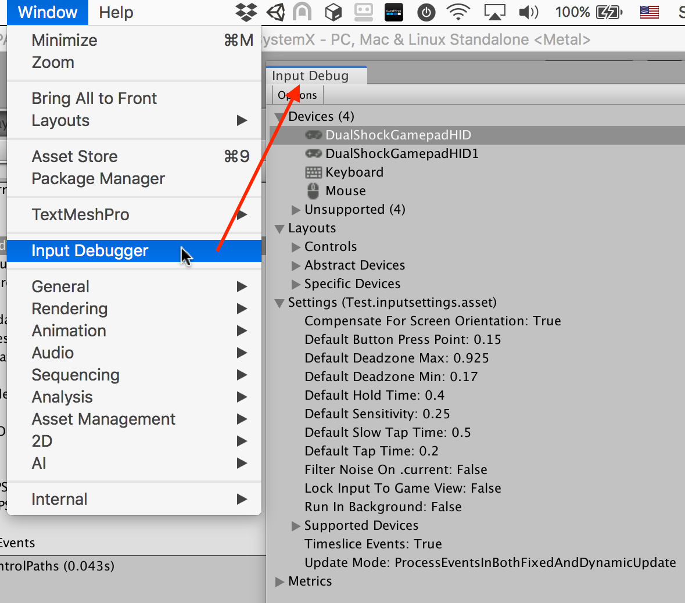

# The input debugger window

When something isn't working as expected, the quickest way to troubleshoot what's wrong is the Input Debugger in the Unity Editor. The Input Debugger provides access to the activity of the Input System in both the Editor and the connected Players.

To open the Input Debugger, go to __Window > Analysis > Input Debugger__ from Unity's main menu.

## Input Debugger

The Input Debugger displays a tree breakdown of the state of the Input System.

|Item|Description|
|----|-----------|
|Devices|A list of all [Input Devices](devices.md) that are currently in the system, and a list of unsupported/unrecognized Devices.|
|Layouts|A list of all registered Control and Device layouts. This is the database of supported hardware, and information on how to represent a given piece of input hardware.|
|Actions|Only visible in Play mode, and only if at least one [Action](actions.md) is enabled.  A list of all currently enabled Actions, and the Controls they are bound to.  Refer to [Debugging Actions](debug-action.md).|
|Users|Only visible when one or more `InputUser` instances exist. See documentation on [user management](user-management.md).  A list of all currently active users, along with their active Control Schemes and Devices, all their associated Actions, and the Controls these Actions are bound to.  Note that `PlayerInput` uses `InputUser` to run. When using `PlayerInput` components, each player has an entry in this list.  Refer to [Debugging users and PlayerInput](debug-users-playerinput.md).|
|Settings|The currently active Input System [settings](input-settings.md).|
|Metrics|Statistics about Input System resource usage.|
