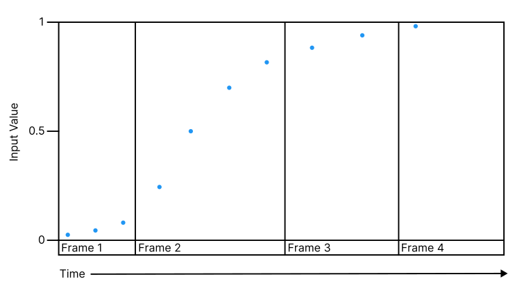
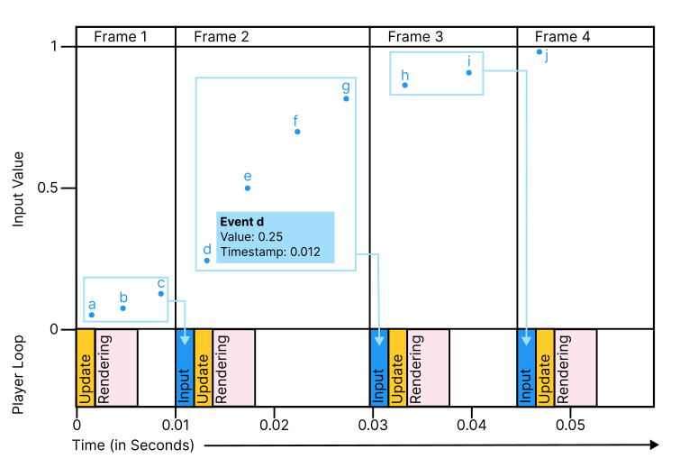

# The input events queue

The Input System receives information from hardware input devices as a stream of events. These events represent either system events received from the input device, or snapshots in time based on frequent samples from the device.

The incoming events are stored in a queue, and by default are processed each frame. Input controls which have discrete (on/off) states, such as a button on a gamepad or mouse, generate corresponding single discrete events when they change state. Input controls with a range of motion, for example a stick or trigger on a gamepad that can be gradually moved over a period of time, generate a stream of individual events in rapid succession that approximates the smooth change in value.

*A diagram showing an example of events coming from a smoothly changing analog input such as a gamepad stick over a period of four frames. In this example, the events are occurring faster than the game’s frame rate, which means multiple events are received each frame.*

Because a device can cause events at times when the input system can't process them (for example, during the rendering phase of the player loop), these events are placed in an incoming queue, and the input system processes them in batches at frequent intervals.

## Input Event Queue Processing

Unity’s player loop repeats at frequent intervals depending on how fast your game or app is running. The player loop repeats once per frame, and performs the Update and FixedUpdate calls. However, the player loop in your game or app usually runs at a rate that's different to the rate of incoming events from input controls, which tend to have their own rate of operation.

This means that each time an Update cycle occurs while a user is moving an input control, there's likely to be a queue of events representing the gradual change in values that occurred between the last frame and the current frame. This queue is processed at the beginning of the next Update or FixedUpdate, depending on which [**Input Update Mode**](timing-select-mode.md) you're using.

## Event grouping and processing

To pass through these incoming input events to your code, the Input System groups and processes them at a specific time within the [Player Loop](https://docs.unity3d.com/Manual/ExecutionOrder.html). This is either just before the next `Update` if the Input Update Mode is set to **Process Events In Dynamic Update**, or just before the next `FixedUpdate` if the Input Mode is set to **Process Events in Fixed Update**.

The following diagram shows how each batch of events (labeled with letters) is processed at the start of the subsequent frame, when the Input Update mode is set to **Process Events in Dynamic Update**. Events (**a**), (**b**) & (**c**) occurred during frame 1, and so are processed at the start of frame 2, before frame 2’s Update() call. Events (**d**), (**e**), (**f**) & (**g**) occurred during frame 2, and so are processed at the start of frame 3. Events (**h**) & (**i**) occur during frame 3, and so are processed at the start of frame 4.

This means that the exact time that your code receives the events isn't the same as the time the event was received by the input system in Unity. For this reason, when you're using event callbacks (as opposed to polling), the Input System includes time stamps for each event so that you can know when each event was generated.

For example, event (**d**) in the diagram is received from the device by the input system at time 0.012 s, but the time at which your code receives the event callback is at the start of the next frame, at about 0.03 s. It retains its timestamp of 0.012 s, but it, along with events (**e**), (**f**), and (**g**), are all processed by your code at almost exactly the same time, each marked with their own time stamps.
