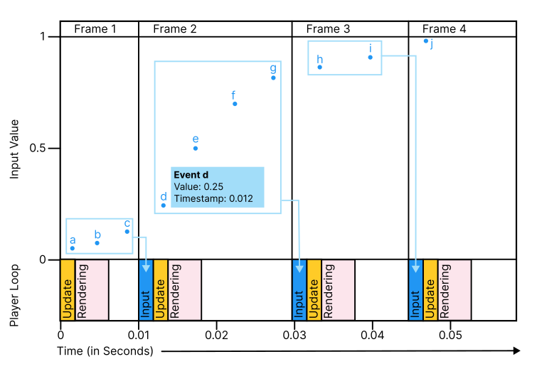

# Optimize for dynamic update (non-physics) scenarios

If you're not working with the physics system or using `FixedUpdate`, always set the input system to process input in sync with the frame rate and `Update()` calls. This is the default setting, but to check or set this, go to  **Project Settings** \> **Input System Package** \> **Input Settings**, and set **Update Mode** to **Process Events in Dynamic Update**.

You can use either a Polling or Event-driven approach to read and process input each frame. You can find out more about Polling or Event-driven approaches in [Responding To Actions](RespondingToActions.html). Whether you choose polling or event-driven, as long as you have your Update Mode set to **Process Events in Dynamic Update**, you receive the latest events and values at the start of each frame.

## Polling technique

Poll input in `Update` and use those values to control your game in `Update`. If there were multiple events after the last frame completed (for example, multiple changing position values of a continuously moving gamepad stick), polling gives you the most recently processed value which is often fine for most scenarios. This approach is often called **sample-and-hold** and is a form of down-sampling, because individual subframe information is discarded. For example, in the scenario shown in the diagram below, polling the input on frame 3 gives the value for event (**g**), while the values for events (**d**) (**e**) and (**f**) are discarded.

Also use `Update` to poll for discrete on/off state changes using API such as [`WasPressedThisFrame`](../api/UnityEngine.InputSystem.InputAction.html#UnityEngine_InputSystem_InputAction_WasPressedThisFrame_) and **WasReleasedThisFrame**.

> [!NOTE]
> The input system doesn't detect multiple discrete on/off events that happen in a single frame when you use the poll driven approach. Multiple discrete on/off events might happen if your game is running at a low frame rate and a user repeatedly presses a button very rapidly, or if the user is using a type of game controller with a rapid "auto fire" mode. The polling technique also can't detect the order of multiple buttons were pressed on the same frame. Use event-driven input if you require this information.

### Event-driven technique

All events that occurred since the last frame are immediately processed before the current frame's `Update`, in the order that they were received. For continuously changing values  (for example, multiple changing position values of a continuously moving gamepad stick), you might receive multiple events per frame with backdated timestamps indicating when they occurred between the last frame and the start of the current frame.

You can read and store input values from the input events in your event handler methods, and use those values to control your game in `Update`.

For example, in the scenario shown in the previous diagram, at the start of frame 3, you receive events for (**d**), (**e**), (**f**), and (**g**) and can process all of them in your game code.
