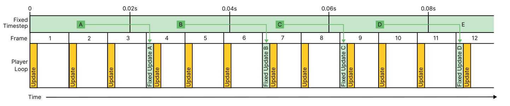
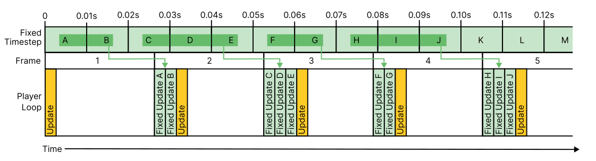
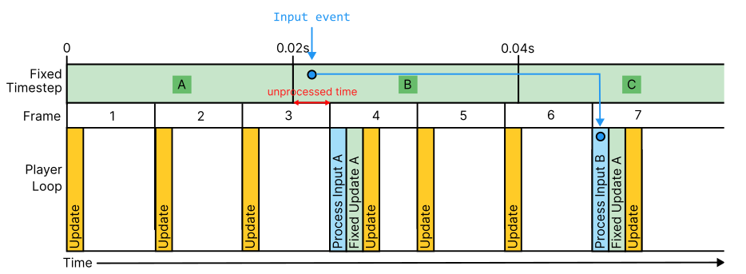

# Optimize for fixed-timestep or physics-based scenarios

If you are working with the physics system or using `FixedUpdate` to control your game in a scenario where a small amount of input latency is acceptable (for example, a few frames), the simplest approach is to set the [input system update mode](./timing-select-mode.md) to **Process Events in Fixed Update**. This means your input code in `FixedUpdate` will operate as expected.

To get the minimum possible latency from the Input System and minimize lag, set the input system update mode to **Process Events in Dynamic Update**. However in doing this, you must understand how to avoid the problems which can arise when using this strategy. Although it might seem incorrect if you have code in `FixedUpdate`, for most cases, this approach minimizes lag compared with processing events in Fixed Update. The reasons for this are explained in detail on this page. Having a good understanding of how input is processed in each mode allows you to make your own decision about how best to process input for your particular project.

## Input in Fixed Update mode

When you set the input system update mode to **Process Events in Fixed Update**, input events are processed in groups according to whether their timestamp falls within the current fixed time step. There might be none, one, or multiple `FixedUpdate` calls processed per frame depending on how fast the game's frame rate is updating compared with the fixed update time step period.

If your game’s frame rate is running faster than the fixed time step period, you will have either zero or one `FixedUpdate` call per frame, depending whether the previous fixed time step has completed or not. If your game’s frame rate is running slower than the fixed time step period, you will have one or more `FixedUpdate` calls per frame \- as many as are required to catch up with the number of completed fixed time step periods that have elapsed.

You can learn more about how the player loop processes fixed update time steps in [Time and Framerate Management](https://docs.unity3d.com/Manual/TimeFrameManagement.html).

It’s important to understand that Fixed Update provides a simulation of code running at fixed time deltas (the fixed time step), however it does not actually run at regular time intervals. Instead, at the start of each frame loop, Unity will run as many Fixed Update steps as is needed to catch-up to the current frame’s time. If a whole fixed time step hasn't completed yet, no Fixed Update steps occur. If more than one whole fixed time step has elapsed, more than one Fixed Update step occurs. This means that on each frame, the `FixedUpdate` method can be called a variable number of times (or even not at all) depending on how much time has elapsed since the last frame and the value set for the Fixed Update time step.


### When the frame rate runs faster than fixed time step duration



This diagram shows the frame rate running faster than the fixed update time step rate. Time progresses to the right, each frame is numbered, and shows its `Update` call at the start of the frame in orange. The fixed time step here is 0.02 seconds (50 times per second), and the game is running faster, at about 80 frames per second. In this situation there are some frames with one fixed update call, and some frames with none, depending on whether a full fixed update time step has completed by the time the frame starts. The fixed time step periods are marked with letters A, B, C, D, E, and the frames in which their corresponding fixed update calls occur are marked in green. The fixed update call for time step A occurs at the start of frame 4, the FixedUpdate call for time step B occurs at the start of frame 7, and so on.

### When the frame rate runs slower than the fixed time step duration



This diagram shows the opposite scenario, when the fixed update cycle is running faster than the frame rate. The fixed time step here is 0.01 seconds (100 times per second), and the game frame rate is running slower, at about 40 frames per second. In this situation most frames have multiple fixed update calls before each update call, the number depending on how many whole update time steps have elapsed since the previous frame. The fixed update time step periods are marked with letters A, B, C, and so on, and  frames in which their corresponding fixed update calls occur are marked in green. The fixed update call for time step A and B occurs at the start of frame 2, the fixed update call for frames C, D & E occur at the start of frame 3, and so on.


In both types of situation, whether the frame rate is running either faster or slower than the fixed time step, the start of the frame usually occurs somewhere part-way through a fixed time step interval. This means a portion of the most recent fixed time step period occurs before the frame, and some during the frame. Partially elapsed fixed time step periods like this aren't processed until the frame after they have fully elapsed.

## Implications for input lag in fixed time step mode

Because input that occurs during partially elapsed time steps isn't processed until the frame after the time step has fully completed, this has implications for increased input lag in fixed time step mode. There's almost always some amount of unprocessed time left between the end of the last fixed time step, and the start of the next frame. This means it's possible for input events to occur within that unprocessed time.

An example of an input event occurring during such unprocessed time is shown in this diagram:



This diagram shows the frame rate running faster than the fixed update time step rate. Each frame is numbered (1 to 7), and shows its `Update` call at the start of the frame in orange. The fixed time step here is 0.02s (50 steps per second), and the game is running faster, at about 80 frames per second. In this situation there are some frames with one fixed update call, and some frames with none.

The diagram shows an input event (shown as a blue dot) that occurs during some unprocessed time during frame 3. Although the event occurs during frame 3, it's not processed in the fixed update input processing step at the start of frame 4 because it didn't occur during fixed time step (**A**). Instead, it occurred during fixed time step (**B**), which is processed at the start of frame 7 \- the first frame to occur after fixed time step (**B**) has completely elapsed.

This has the counterintuitive effect that the processing of input on frame 4 actually ignores some input that has already occurred on frame 3, because it's only processing events that occurred in the last complete fixed time step: (**A**).

## Minimize latency when using fixed update code

To minimize input latency in input code in `FixedUpdate` calls, set the input system update mode to **Process Events in Dynamic Update**, which eliminates the problem of unprocessed time described previously. You can then use an event-driven or polling technique to read your input without missing events that occurred after the last fixed timestep but before the current frame.

However, the **Process Events in Dynamic Update** mode might introduce the problem of missed or duplicate discrete events, such as attempting to read whether a button was pressed in a given frame. If you use this strategy, you must understand how to [avoid missed or duplicate events](./timing-missed-duplicate-events.md) in mixed timing scenarios requiring fixed and dynamic input.

### Event-driven input with fixed update code

For event-driven input, where the [Player Input component](./PlayerInput.md) calls events in your code, you should store the input values in variables which you can then read in your `FixedUpdate` call. For example:

```
using UnityEngine;
using UnityEngine.InputSystem;

public class ExampleScript : MonoBehaviour
{
    Vector2 moveInputValue;
    Rigidbody rigidBody;
    public float moveForce = 10;

    private void Start()
    {
        rigidBody = GetComponent<Rigidbody>();
    }

    public void OnMove(InputAction.CallbackContext context)
    {
        // in the event callback, we store the input value
        moveInputValue = context.ReadValue<Vector2>();
    }

    private void FixedUpdate()
    {
        // in fixed update, we use the stored value for
        // applying physics forces
        rigidBody.AddForce(moveInputValue * moveForce);
    }
}
```

### Polling input with fixed update code

For code where you're polling input action values, you can read the values directly from `FixedUpdate`:

```
using UnityEngine;
using UnityEngine.InputSystem;

public class ExampleScript : MonoBehaviour
{
    InputAction moveAction;
    Rigidbody rigidBody;
    public float moveForce = 10;

    private void Start()
    {
        moveAction = InputSystem.actions.FindAction("move");
    }

    private void FixedUpdate()
    {
        Vector2 moveInputValue = moveAction.ReadValue<Vector2>();
        rigidBody.AddForce(moveInputValue * moveForce);
    }
}
```
