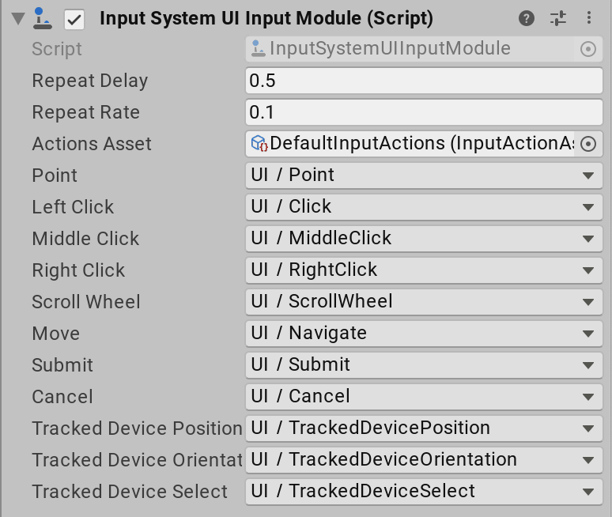

# UI Input Module component reference

Use the following properties to configure [InputSystemUIInputModule](../api/UnityEngine.InputSystem.UI.InputSystemUIInputModule.html):

|**Property**|**Description**|
|--------|-----------|
|[Move Repeat Delay](../api/UnityEngine.InputSystem.UI.InputSystemUIInputModule.html#UnityEngine_InputSystem_UI_InputSystemUIInputModule_moveRepeatDelay)|The initial delay (in seconds) between generating an initial [IMoveHandler.OnMove](https://docs.unity3d.com/Packages/com.unity.ugui@1.0/api/UnityEngine.EventSystems.IMoveHandler.html) navigation event and generating repeated navigation events when the __Move__ Action stays actuated.|
|[Move Repeat Rate](../api/UnityEngine.InputSystem.UI.InputSystemUIInputModule.html#UnityEngine_InputSystem_UI_InputSystemUIInputModule_moveRepeatDelay)|The interval (in seconds) between generating repeat navigation events when the __Move__ Action stays actuated. Note that this is capped by the frame rate; there will not be more than one move repeat event each frame so if the frame rate dips below the repeat rate, the effective repeat rate will be lower than this setting.|
|[Actions Asset](../api/UnityEngine.InputSystem.UI.InputSystemUIInputModule.html#UnityEngine_InputSystem_UI_InputSystemUIInputModule_actionsAsset)|An [Input Action Asset](ActionAssets.md) containing all the Actions to control the UI. You can choose which Actions in the Asset correspond to which UI inputs using the following properties.  By default, this references a built-in Asset named *DefaultInputActions*, which contains common default Actions for driving UI. If you want to set up your own Actions, [create a custom Input Action Asset](ActionAssets.md#creating-input-action-assets) and assign it here. When you assign a new Asset reference to this field in the Inspector, the Editor attempts to automatically map Actions to UI inputs based on common naming conventions.|
|[Deselect on Background Click](../api/UnityEngine.InputSystem.UI.InputSystemUIInputModule.html#UnityEngine_InputSystem_UI_InputSystemUIInputModule_deselectOnBackgroundClick)|By default, when the pointer is clicked and does not hit any `GameObject`, the current selection is cleared. This, however, can get in the way of keyboard and gamepad navigation which will want to work off the currently selected object. To prevent automatic deselection, set this property to false.|
|[Pointer Behavior](../api/UnityEngine.InputSystem.UI.InputSystemUIInputModule.html#UnityEngine_InputSystem_UI_InputSystemUIInputModule_pointerBehavior)|How to deal with multiple pointers feeding input into the UI. See [pointer-type input](#pointer-type-input). The options are:   - **Single Mouse or Pen But Multi Touch And Track**: Behaves like **Single Unified Pointer** for all input that is not classified as touch or tracked input, and behaves like **All Pointers As Is** for tracked and touch input. - **Single Unified Pointer**: All pointer input is unified such that there is only ever a single pointer. This includes touch and tracked input.  - **All Pointers As Is**: The UI Input Module does not unify any pointer input. Any device, including touch and tracked devices that feed pointer input actions, has its own pointer (or multiple pointers for touch input).|
|[Cursor Lock Behavior](../api/UnityEngine.InputSystem.UI.InputSystemUIInputModule.html#UnityEngine_InputSystem_UI_InputSystemUIInputModule_cursorLockBehavior)|Controls the origin point of UI raycasts when the cursor is locked. |