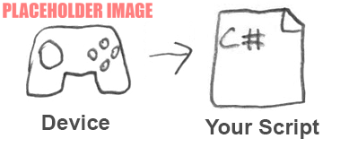

# Workflow Overview - Directly Reading Device States



This is the simplest and most direct input workflow, but the least flexible. It bypasses the [Input Actions editor](actions-editor.md), so you do not benefit from all the features come with [Actions](actions.md).

It can be useful if you want a quick implementation with one specific type of device. It's generally not the best choice if you want to provide your users with multiple types of input or if you want to target multiple platforms.

You can directly read the values from connected devices by referring to the device’s [controls](controls.md) and reading the values they are currently generating, using code like this:

```CSharp
using UnityEngine;
using UnityEngine.InputSystem;

public class MyPlayerScript : MonoBehaviour
{
    void Update()
    {
        var gamepad = Gamepad.current;
        if (gamepad == null)
        {
            return; // No gamepad connected.
        }

        if (gamepad.rightTrigger.wasPressedThisFrame)
        {
            // 'Use' code here
        }

        Vector2 move = gamepad.leftStick.ReadValue();
        {
            // 'Move' code here
        }
    }
}
```

The example above reads values directly from  the right trigger, and the left stick, of the currently connected [gamepad](devices-gamepads.md). It does not use the input system’s "Action" class, and instead the conceptual actions in your game or app, such as "move" and "use", are implicitly defined by what your code does in response to the input. You can use the same approach for other Device types such as the [keyboard](xref:UnityEngine.InputSystem.Keyboard) or [mouse](xref:UnityEngine.InputSystem.Mouse).

## Pros and Cons

This can be the fastest way to set up some code which responds to input, but it is the least flexible because there is no abstraction between your code and the values generated by a specific device.

If you choose to use this technique:

* You won’t benefit from Unity’s management of [actions](actions.md) and [interactions](Interactions.md).

* It is harder to make your game or app work with multiple types of [input device](devices.md).

* Your input bindings are hard-coded in your script, so any changes to bindings require changes to the code.

* It is harder to allow the user to [remap their own controls to different actions at run time](rebind-action-runtime.md).

You can find an example of this workflow in the sample projects included with the input system package. To find it, in the Project window, look in **Assets > Samples > SimpleDemo** and open the scene: **SimpleDemo_UsingState**.

Refer to [Supported Devices](supported-devices-reference.md) for more information about devices supported by the input system, and the API to read their states.

For more a more flexible workflow, refer to the [Actions Workflow](using-actions-workflow.md).
