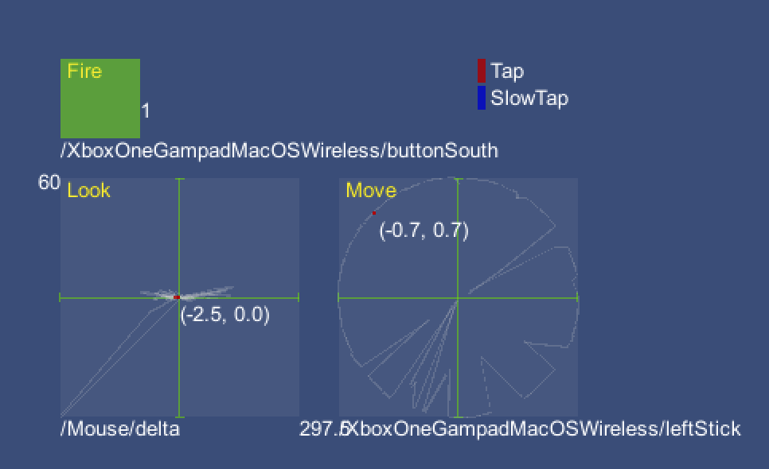

# Visualise actions

`InputActionVisualizer` visualizes the current state of a single Action in real time. You can have multiple Action visualizers to visualize the state of multiple Actions. This can also display the current value of the Action and the Control currently driving the Action, and track the state of [Interactions](Interactions.md) over time. Check the `SimpleControlsVisualizer` Scene in the sample for examples.

