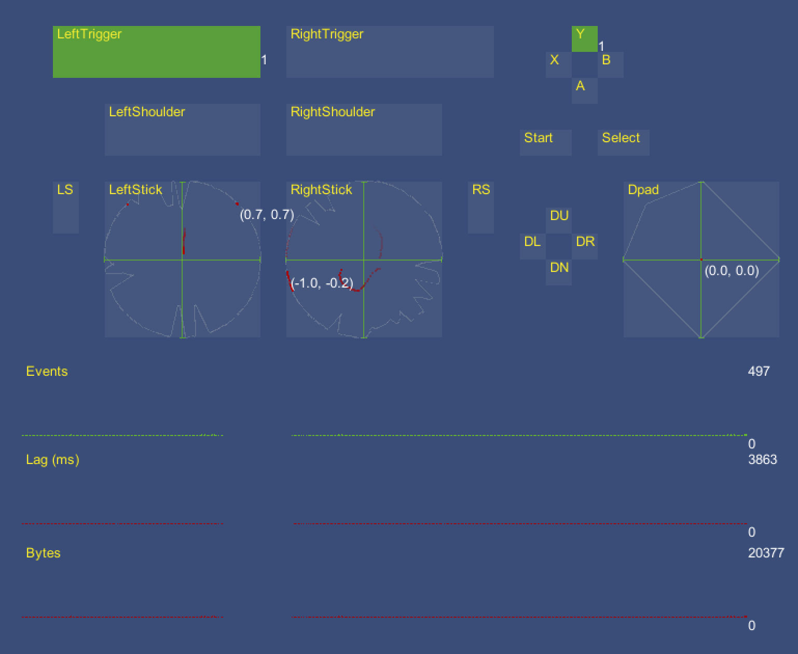

# Visualise input controls

`InputControlVisualizer` visualizes the current state of a single Control in real time. You can have multiple Control visualizers to visualize the state of multiple Controls. Check the `GamepadVisualizer`, `MouseVisualizer`, or `PenVisualizer` Scenes in the sample for examples.

