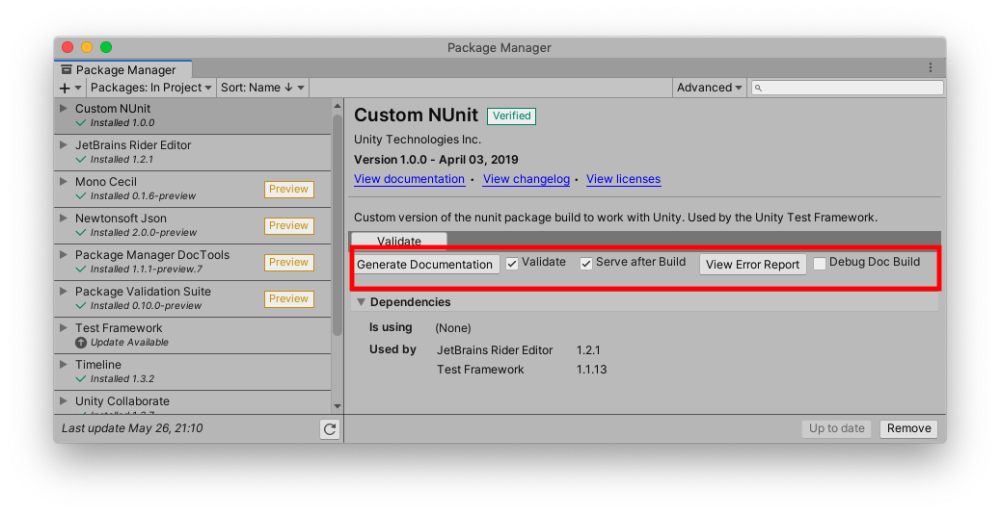

# Package Manager Documentation Tools
The package documentation tools is a package manager ui extension that generates documentation for a package. This allows package developers to preview what their documentation will look like in its final published form.

*This is an internal Unity tool and will not be supported.*

<a name="Install"></a>
## Installation

### Pre-requisites
The documentation tools require the package manager ui extension mechanism, which is available from version 1.9.3 or later.

### Installation
You can find the package manager documentation tools under the name `Package Manager Documentation Tools` from the package manager window, or you can add it to your editor's `manifest.json` file like this:

```
{
    "dependencies": {
        "com.unity.package-manager-doctools": "1.0.0-preview.9"
    }
}
```

Additionally, if you want to simply install it from the package manager UI, simply set your registry to staging in your `manifest.json`, like so:

```
{
  "registry": "https://staging-packages.unity.com"
    "dependencies": {}
}
```

<a name="Generate"></a>
## Generate Documentation
You can press the `Generate Documentation` button on an _installed_ packages to generate its documentation. After pressing the button, a website will be built on your local machine using _DocFx_. An explorer/finder window will be opened at the location where the website was created, and the website will be opened using your default web browser since _DocFx_ also hosts the website locally.



## Table of Content
The generated documentation will have no table of content by default, unless there is an `TableOfContents.md` file in the `Documentation` folder of the package. If there is a `TableOfContents.md` file, then there _must_ be an `index.md` file
which will be the landing page when going into the manual.

The table of content supports the DocWorks table of content format, which looks a liitle bit like this:

```
* [Unity Manual](UnityManual)
     * [Manual Versions](UnityManual#table-of-content)
     * [Switching between Unity versions](SwitchingDocumentationVersions)
     * [OfflineDocumentation](OfflineDocumentation)
     * [Whats New 5.6](WhatsNew56)
     * [Leave Feedback](LeaveFeedback)
* [Installing Unity](InstallingUnity)
     * [Deploying Unity Offline](DeployingUnityOffline)
```

Where the text in `[]` brackets will be the table of content title, and the text in `()` parenthesis will be the name of a documentation `.md` file. You can link to subsections of an `.md` file by adding a `#title-name` suffix
where `title-name` is the name of a title in a documentation `.md` file header with spaces replaced by `-` dashes (for example, to link to this section, you would write: ```[Some Title](index#table-of-content)```.

<a name="Preprocessor"></a>
## Preprocessor Directives
If you have code that inside a preprocessor directive (eg: `#if MY_CONSTANT <code> #endif`) and you want this code to have its API documented, you can use DocTools preprocessor directives to make sure that these APIs will have their docs generated.

DocTools adds the `PACKAGE_DOCS_GENERATION` directive to code when generating the API documentation, so you can either add this to your code (eg: `#if MY_CONSTANT || PACKAGE_DOCS_GENERATION <code> #endif`.

Alternatively, you can simply tell DocTools which preprocessor directives to enable when generating documentation. This can be done by adding a `config.json` file inside the `Documentation~` folder with a `DefineConstants` string property. For example:

```
{ "DefineConstants": "MY_CONSTANT;MY_OTHER_CONSTANT" }
```

## Custom Filtering

You can add your own custom `filter.yml` in the `Documentation~` folder of your package if you need to filter out specific APIs from your package, or override
the default filtering rules.

The rules for custom filtering can be found [here](https://dotnet.github.io/docfx/tutorial/howto_filter_out_unwanted_apis_attributes.html)

The following is an example of a `filter.yml` that excludes System.Object classes and types marked as obsolete:

```
apiRules:
  - exclude:
      # inherited Object methods
      uidRegex: ^System\.Object\..*$
      type: Method
  - exclude:
      hasAttribute:
        uid: System.ObsoleteAttribute
      type: Type
```

## Per-project metadata

You can set specific metadat values for a project by adding a `projectMetadata.json` file to the project's `Documentation~` folder. Values set in this file override values set in the DocFX configuration file. Currently supported metada include:

```
{
    "_appTitle": "Unity Documentation",
    "enableTocForManual": true
}
```

| Name | Purpose |
| :------- | :---------- |
| `_appTitle` | A string appended to the HTML page title. Shows up prominently in search results. By default, this value is set to the package display name, but you can override that here.|
| `enableTocForManual` | Enables/disables the TOC on the left side of the page for the "manual" section. Has no effect on the "script reference" section. By default, this is set to `false` for single-page manuals and `true` for multi-page manuals. |

Note that by default the `_appTitle` field is set to  `DEFAULT_APP_TITLE`, and the `_packageVersion` field is set to `DEFAULT_PACKAGE_VERSION` in the DocFX config file. These values are automatically updated for each package and combined in the HTML page template as `PACKAGE DISPLAY NAME | VERSION`. This combined string is used in the page title and breadcrumb trail.

**Do not override the following metadata values:**

| Name | Purpose |
| :------- | :---------- |
| `_enableSearch` | Turning this off disables search, but does not remove the search box. |
| `_appLogoPath` | Sets the path to the logo graphic. |
| `_disableToc` | Turns off the table of contents displayed on the left side of all pages. Turning this off makes it rather dificult to navigate through a multi-page documentation set. |
| `_packageVersion` | The package version string, which is appended to the _appTitle to become part of each html page title and the breadcrumb trail. Set to an empty string to suppress the version display. |

# Technical details

## Requirements

This version of Unity Package Manager is compatible with the following versions of the Unity Editor:

* 2018.1 and later (recommended)

## Documentation revision history
|Date|Reason|
|---|---|
|April 12, 2018|Document created. Matches package version 1.0.0-preview.|
