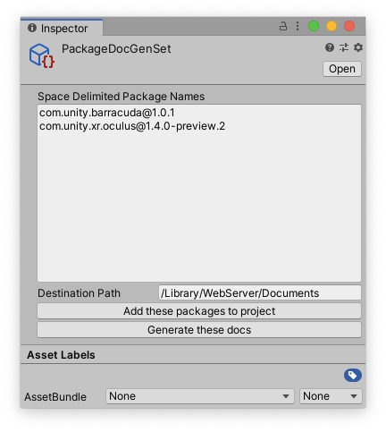

# Package Manager Documentation Tools
The package documentation tools is a package manager ui extension that generates documentation for a package. This allows package developers to preview what their documentation will look like in its final published form.

*This is an internal Unity tool and is be supported for external use.*

<a name="Install"></a>
## Installation

### Pre-requisites
The documentation tools require the package manager ui extension mechanism, which is available from version 1.9.3 or later.

### Installation
You can find the package manager documentation tools under the name `Package Manager Documentation Tools` from the package manager window, or you can add it to your editor's `manifest.json` file like this:

```
{
    "dependencies": {
        "com.unity.package-manager-doctools": "1.0.0-preview.9"
    }
}
```

Additionally, if you want to simply install it from the package manager UI, simply set your registry to staging in your `manifest.json`, like so:

```
{
  "registry": "https://staging-packages.unity.com"
    "dependencies": {}
}
```

<a name="Generate"></a>
## Generate Documentation
You can press the `Generate Documentation` button on an _installed_ packages to generate its documentation. After pressing the button, a website will be built on your local machine using _DocFx_. An explorer/finder window will be opened at the location where the website was created, and the website will be opened using your default web browser since _DocFx_ also hosts the website locally.


* **Validate** -- Enable the Validate option to also run the Package Validation Suite to find any missing documentation in your API scripts. The report is included in the Error Report.
* **Serve after Build** -- Enable the Serve after Build option to view the generated docs in a browser. Note that this feature relies on an internal, local web server. Since the web server is running in the Editor, any domain reload shuts down the server. The structure of the generated HTML does not support viewing from the local file server.
* **View Error Report** -- Shows errors and warnings emitted by DocFX or the Package Validation tool.
* **Debug Doc Build** -- Enable this option to save the intermediate build files used during doc generation. Only use enable this if you need to debug at the DocFX build level. The terminal command needed to rerun DocFX is printed to the Unity Console so that you can easily rerun the DocFX portion of the doc build.

Note that the Validate button shown in the screenshot is inserted by the Validation package. You can use this button to run the Validation Suite checks as normal, but the results aren't included in the doc error report. The Validation Suite checks identify C# ctypes and members that do not have any documentation. The Doc Tools Error report includes missing files, bad links, and malformed document contents, but does not list "missing" documentation.

## Landing pages
There are two "landing pages" in package docs, one for the Manual, and one for the Script Reference. 

For the Manual, the landing page is created from the `index.md` file found in the `Documentation~` folder. If no such file exists, the tools uses the first markdown file it founds. Thus, if you have more than one markdown file, you should always `index.md` as your first, or landing, page. (In fact if you include a `TableOfContents.md` file, you MUST include `index.md`.)

For the Script Reference, you can optionally include a markdown file, `api_index.md`. If this file exists, the tool puts the contents onto the first page of the Script Reference. This is a good place to outline the structure of your API and list the major classes. When making links, note that the file ends up in the `api` folder, not the `manual` folder, so ensure that relative links reflect the final folder structure. You can also use DocFX's `xref` link syntax and uids:

    [API class](xref:Unity.Entities.SystemBase)
    [Manual topic](xref:uid-you-assigned-to-topic)

DocFX assigns uids to all classes and members automatically (see the `xrefmap.xml` file in the generated output to look these up -- they can sometimes be complicated to figure out). You must assign a uid to a manual topic, which you can do by placing the following text at the top of the markdown file for the topic:

    ---
    uid: uid-you-assigned-to-topic
    ---

If you do not include `api_index.md`, the tools generates a generic, one-sentence, landing page.

## Table of Content
The generated documentation will have no table of content by default, unless there is an `TableOfContents.md` file in the `Documentation~` folder of the package. If there is a `TableOfContents.md` file, then there _must_ be an `index.md` file
which will be the landing page when going into the manual.

The table of content supports the DocWorks table of content format, which looks a liitle bit like this:

```
* [Unity Manual](UnityManual)
     * [Manual Versions](UnityManual#table-of-content)
     * [Switching between Unity versions](SwitchingDocumentationVersions)
     * [OfflineDocumentation](OfflineDocumentation)
     * [Whats New 5.6](WhatsNew56)
     * [Leave Feedback](LeaveFeedback)
* [Installing Unity](InstallingUnity)
     * [Deploying Unity Offline](DeployingUnityOffline)
```

Where the text in `[]` brackets will be the table of content title, and the text in `()` parenthesis will be the name of a documentation `.md` file. You can link to subsections of an `.md` file by adding a `#title-name` suffix
where `title-name` is the name of a title in a documentation `.md` file header with spaces replaced by `-` dashes (for example, to link to this section, you would write: ```[Some Title](index#table-of-content)```.

<a name="Preprocessor"></a>
## Preprocessor Directives
If you have code that inside a preprocessor directive (eg: `#if MY_CONSTANT <code> #endif`) and you want this code to have its API documented, you can use DocTools preprocessor directives to make sure that these APIs will have their docs generated.

DocTools adds the `PACKAGE_DOCS_GENERATION` directive to code when generating the API documentation, so you can either add this to your code (eg: `#if MY_CONSTANT || PACKAGE_DOCS_GENERATION <code> #endif`.

Alternatively, you can simply tell DocTools which preprocessor directives to enable when generating documentation. This can be done by adding a `config.json` file inside the `Documentation~` folder with a `DefineConstants` string property. For example:

```
{ "DefineConstants": "MY_CONSTANT;MY_OTHER_CONSTANT" }
```

## Custom Filtering

You can add your own custom `filter.yml` in the `Documentation~` folder of your package if you need to filter out specific APIs from your package, or override
the default filtering rules.

The rules for custom filtering can be found [here](https://dotnet.github.io/docfx/tutorial/howto_filter_out_unwanted_apis_attributes.html)

The following is an example of a `filter.yml` that excludes System.Object classes and types marked as obsolete:

```
apiRules:
  - exclude:
      # inherited Object methods
      uidRegex: ^System\.Object\..*$
      type: Method
  - exclude:
      hasAttribute:
        uid: System.ObsoleteAttribute
      type: Type
```

## Per-project metadata

You can set specific metadat values for a project by adding a `projectMetadata.json` file to the project's `Documentation~` folder. Values set in this file override values set in the DocFX configuration file. Currently supported metada include:

```
{
    "_appTitle": "Unity Documentation",
    "enableTocForManual": true
}
``` 

| Name | Purpose |
| :------- | :---------- |
| `_appTitle` | A string appended to the HTML page title. Shows up prominently in search results. By default, this value is set to the package display name, but you can override that here.|
| `enableTocForManual` | Enables/disables the TOC on the left side of the page for the "manual" section. Has no effect on the "script reference" section. By default, this is set to `false` for single-page manuals and `true` for multi-page manuals. |

Note that by default the `_appTitle` field is set to  `DEFAULT_APP_TITLE`, and the `_packageVersion` field is set to `DEFAULT_PACKAGE_VERSION` in the DocFX config file. These values are automatically updated for each package and combined in the HTML page template as `PACKAGE DISPLAY NAME | VERSION`. This combined string is used in the page title and breadcrumb trail.

**Do not override the following metadata values:**

| Name | Purpose |
| :------- | :---------- |
| `_enableSearch` | Turning this off disables search, but does not remove the search box. |
| `_appLogoPath` | Sets the path to the logo graphic. |
| `_disableToc` | Turns off the table of contents displayed on the left side of all pages. Turning this off makes it rather dificult to navigate through a multi-page documentation set. |
| `_packageVersion` | The package version string, which is appended to the _appTitle to become part of each html page title and the breadcrumb trail. Set to an empty string to suppress the version display. |

## Snippets

You can include a markdown file as content in another with:

`[!include[](snippets/snippet-content.md)]`

[!include[](snippets/snippet-content.md)]
 
## Batch Generation
You can batch generate docs for a set of packages from either inside Unity or by passing commandline parameters to the Unity executable.

**Note:** This should be considered an experimental feature. Batch generating docs seems to work fine; however, batch adding packages has limitations. Some packages require user interactions the first time they are added and sometimes adding more than one package at a time generates errors -- this is probably related to packages that share dependencies (or are dependencies).

### Using a PackageSet Asset

To use a PackageSet Asset, first create one with the Unity **Create Asset** menu (menu: **Assets > Create > Doc Tools > Create Package Set Asset**).

Next, select the new Asset to display its Inspector:



Paste a list of packages names (including @version) into the text field. 

You can optionally set a destination path to override the normal output path for the docs (which is *c:/temp* on Windows and deep inside a hidden *Library* folder on Mac). This can be helpful when generating multiple sets of docs so you can view them in a local web server.

Note that after batch generating a set of docs, you can find the error report in the *Logs/DocToolReports* directory of the Unity project folder (or from the Package Manager window for an individual package).

### Using commandline arguments to Unity
You can use the Batch class to generate docs by passing command line arguments to Unity. To use batch generation, you must have a project that already contains this Doc Tools package (since that is where the batch code exists).

There are three batch commands supported, each can be given one or more package IDs as input:

* **AddPackages** -- Installs the packages through the Package Manager. This must be run unless the packages are already installed in the project.
* **GenerateDocs** -- Generates the docs for the packages. The files are saved to the usual place, hidden in the bowels of your file system.
* **RemovePackages** -- Removes one or more packages using the Package Manager. This step is optional.

These commands must be run as separate steps -- in other words, to add, generate the docs for, and then remove a set of packages, you must invoke Unity three times. An example invocation to do that in a bash shell is:

``` bash
/Applications/Unity/Hub/Editor/2020.1.0b9/Unity.app/Contents/MacOS/Unity   -quit -batchmode -projectPath . -executeMethod UnityEditor.PackageManager.DocumentationTools.UI.Batch.AddPackages -packages="com.unity.entities@0.10.0-preview.6 com.unity.ugui@1.0.0 com.unity.remote-config@1.3.2-preview.1" 
/Applications/Unity/Hub/Editor/2020.1.0b9/Unity.app/Contents/MacOS/Unity   -quit -batchmode -projectPath . -executeMethod UnityEditor.PackageManager.DocumentationTools.UI.Batch.GenerateDocs -packages="com.unity.entities@0.10.0-preview.6 com.unity.ugui@1.0.0 com.unity.remote-config@1.3.2-preview.1" 
/Applications/Unity/Hub/Editor/2020.1.0b9/Unity.app/Contents/MacOS/Unity   -quit -batchmode -projectPath . -executeMethod UnityEditor.PackageManager.DocumentationTools.UI.Batch.RemovePackages -packages="com.unity.entities com.unity.ugui com.unity.remote-config" 

```

(At the time this was written, the RemovePackages function only takes a package name, not the full ID, which is contrary to the documentation.)

# Technical details

## Requirements

This version of Unity Package Manager Doc Tools is compatible with the following versions of the Unity Editor:

* 2019.4 and later

