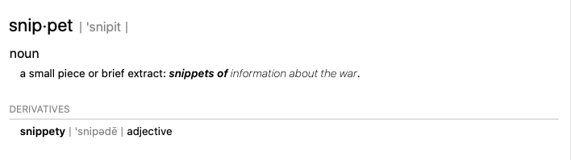

The rest of the content in this section is part of a snippet.



This content is part of a "snippet" file and is included using the markdown inclusion mechanism, the syntax of which is shown above.

If you put your snippets into a folder named, `snippets`, then they are excluded from the markdown to HTML conversion. The content still shows up where it is included, but the files in the snippet folder are not converted into separate HTML files. Markdown files included from other places within `Documentation~` will have HTML files. 

Headings are not altered to suit the place where content is inserted. Thus if you put an H1-level heading in an include file, it becomes an H1-level heading in the destination, even if that doesn't make sense.

Links and images are resolved from their original location in the snippets folder. For example:

```

[link to External Links page](../ExternalLinks.md)
```

The image of the definition of the word snippet (above) and this [link to the External Links page](../ExternalLinks.md) both need an extra "../" in their path.

This form of file inclusion is an extension defined by DocFX Flavored Markdown. See [File Inclusion](https://dotnet.github.io/docfx/spec/docfx_flavored_markdown.html#file-inclusion) for additional information.

